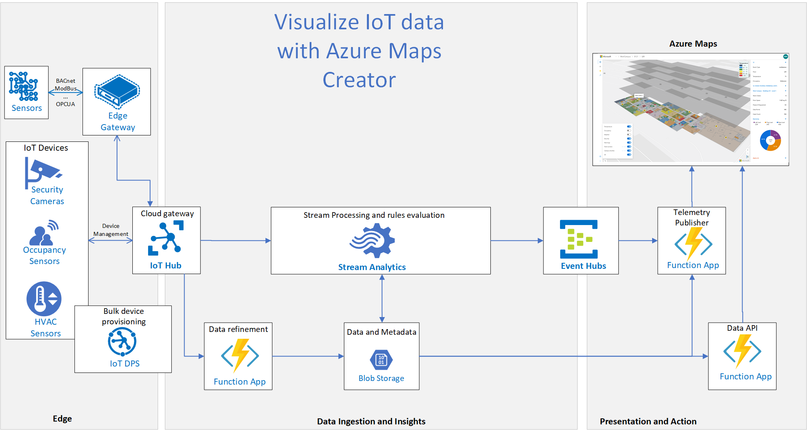

# Live Maps

Sample Application to provide indoor maps visualization of IoT data on top of Azure Maps using [Azure Maps Creator](https://azure.microsoft.com/en-us/blog/azure-maps-creator-now-available-in-preview/)


## Sample Architecture

The image bellow illustrates where the indoor maps integration elements fit into a larger, end-to-end IoT Smart Spaces scenario.



Example scenario:

- Occupancy sensor detects 6 people in the room and sends this data to IoTHub
- During data enrichment and refinement stage we identify what exactly room this data is refering to and it's constraints
- In stream analytics we apply rules on top of the streaming data (room capacity is 4 people) and output EventHub event
- Telemetry Publisher function receives new ipdate event from Event Hub and updates Azure Maps Creator Feature state
- Warning is automatically displayed on the Azure Maps UI within 15 seconds

## Prerequisites

- [Make an Azure Maps account](https://docs.microsoft.com/en-us/azure/azure-maps/quick-demo-map-app#create-an-azure-maps-account)
- [Obtain a subscription key](https://docs.microsoft.com/en-us/azure/azure-maps/quick-demo-map-app#get-the-primary-key-for-your-account)
- [Create Azure Maps Creator resource](https://docs.microsoft.com/en-us/azure/azure-maps/how-to-manage-creator)
- Follow the Azure Maps [Tutorial: Use Azure Maps Creator to create indoor maps](https://docs.microsoft.com/en-us/azure/azure-maps/tutorial-creator-indoor-maps) to create an Azure maps indoor map.
- Upload your Own Drawing package or use sample drawing as a starter
- Create Feature statesets for each dimension of your data that needs to be visualized separetely

## Web App Configuration

The application is configured using [environment variables](https://create-react-app.dev/docs/adding-custom-environment-variables).
You can pass you own configuration by changing the values in `.env` file or by passing them via command line on define
them in your favorite CI tool.

Currently the supported variables are:

- `REACT_APP_MAP_SUBSCRIPTION_KEY` (_required_) - the subscription key to your Azure Maps instance.
- `REACT_APP_API_BASE_URL` - (_optional, defaults to `http://localhost:3001`_) - the base URL for all data-fetching facilities
- `REACT_APP_TRACKER_HOSTNAME` - (_optional, defaults to `localhost:3001`_) - hostname of the tracker service , providing
live data for tracking layers. Note that the value must not contain scheme.

The following URLs can be defined as either relative to base url above (when starting with `/` - they will be prepended
by base URL automatically) or as full URLs, pointing to the source other than defined by base URL.

- `REACT_APP_SITEMAP_URL` (_optional, defaults to `/sitemap`_) - the URL to fetch sitemap data from

The URLs below need to contain a `{locationPath}` placeholder which will be replaced with current location's id/path

- `REACT_APP_SENSORDATA_URL` (_optional, defaults to `/state/{locationPath}`_) - the URL to fetch sensor data from.
- `REACT_APP_SIDEBAR_DATA_URL` (_optional, defaults to `/sidebar/{locationPath}`_) - the URL to fetch sidebar chart data from.
- `REACT_APP_WARNINGS_DATA_URL` (_optional, defaults to `/faults/{locationPath}`_) - the URL to fetch warnings from.

## Server side configuration

Web application requires data feeds for visualizing, livemaps-api Function App project is an sample backend for the Azure Maps Creator Web UI.
LiveMaps application supports visualization for multiple Azure Maps Creator datasets and statesets, it requires multiple configs to be stored.
Config file is stored at the Azure blob storage and available to the frontend client by `Config` Function.
Here is an example of the configuration file used by the application:

    [        
        {
            "subscriptionKey":"[AzureMapsSubscriptionKey1]",
            "datasetId":"2f086edd-aaaa-1111-bbbb-3b230baeb881",
            "buildingId": "pugetsound/westcampus/b121",           
            "tilesetId":"0445b23c-2023-a6fc-64a0-174551a947cb",
            "stateSets":[
                {
                    "stateSetName":"temperature",
                    "stateSetId":"4776884c-aaaa-1111-bbbb-a45a95019d03"
                },
                {
                    "stateSetName":"occupancy",
                    "stateSetId":"9ace7925-aaaa-1111-bbbb-257da031b5c7"
                }
            ],
            "facilityId":"Building121"       
        },
        {
            "subscriptionKey":"[AzureMapsSubscriptionKey2]",
            "datasetId":"2f086edd-aaaa-2222-bbbb-3b230baeb881",       
            "buildingId":"pugetsound/eastcampus/b40",          
            "tilesetId":"29e995fe-aaaa-1111-bbbb-22e2e73a988b",
            "stateSets":[
                {
                    "stateSetName":"temperature",
                    "stateSetId":"6f5cf25d-aaaa-1111-bbbb-ed28c1ec4b7b"
                },
                {
                    "stateSetName":"occupancy",
                    "stateSetId":"9ace7925-aaaa-1111-bbbb-257da031b5c7"
                }
            ],
            "facilityId":"Building40"       
        }
    ]

Sitemap file is stored at the Azure blob storage and available to the frontend client by `SiteMap` Function.

## Sitemap file sample

    {
        "global": {
            "items": [
                "pugetsound"
            ],
            "name": "Global",
            "id": "global",
            "parentId": null,
            "type": "global",
            "latitude": 50.104882,
            "longitude": 32.66734,
            "area": 45058050.3
        },
        "pugetsound": {
            "items": [
                "pugetsound/eastcampus",
                "pugetsound/westcampus"
            ],
            "name": "PUGET SOUND",
            "id": "pugetsound",
            "parentId": "global",
            "type": "region",
            "latitude": 47.64059101,
            "longitude": -122.131319,
            "area": 14235605.0
        },
        "pugetsound/westcampus": {
            "items": [
                "pugetsound/westcampus/b121"
            ],
            "name": "WestCampus",
            "id": "pugetsound/westcampus",
            "parentId": "pugetsound",
            "type": "campus",
            "latitude": 47.64029462,
            "longitude": -122.1375847,
            "area": 5262977.0
        },
        "pugetsound/eastcampus": {
            "items": [
                "pugetsound/eastcampus/b40"
            ],
            "name": "EastCampus",
            "id": "pugetsound/eastcampus",
            "parentId": "pugetsound",
            "type": "campus",
            "latitude": 47.64126329,
            "longitude": -122.1255684,
            "area": 4127849.0
        },
        "pugetsound/westcampus/b121": {
            "items": [
                "pugetsound/westcampus/b121/l01",
                "pugetsound/westcampus/b121/l02",
                "pugetsound/westcampus/b121/l03"
            ],
            "name": "B121",
            "id": "pugetsound/westcampus/b121",
            "parentId": "pugetsound/westcampus",
            "type": "building",
            "latitude": 47.64777601,
            "longitude": -122.1369517,
            "area": 180270.0,
            "config": {
                "buildingId": "pugetsound/westcampus/b121",
                "tilesetId": "[tilesetId]",
                "stateSets": [
                    {
                        "stateSetName": "temperature",
                        "stateSetId": "[stateSetId]"
                    },
                    {
                        "stateSetName": "occupancy",
                        "stateSetId": "[stateSetId]"
                    }
                ],
                "facilityId": "FCL19"
            }
        },
        "pugetsound/westcampus/b121/l01": {
            "items": [],
            "name": "L01",
            "id": "pugetsound/westcampus/b121/l01",
            "parentId": "pugetsound/westcampus/b121",
            "type": "floor",
            "latitude": 47.64777601,
            "longitude": -122.1369517,
            "area": 180270.0
        },
        "pugetsound/westcampus/b121/l02": {
            "items": [],
            "name": "L02",
            "id": "pugetsound/westcampus/b121/l02",
            "parentId": "pugetsound/westcampus/b121",
            "type": "floor",
            "latitude": 47.64777601,
            "longitude": -122.1369517,
            "area": 180270.0
        },
        "pugetsound/westcampus/b121/l03": {
            "items": [],
            "name": "L03",
            "id": "pugetsound/westcampus/b121/l03",
            "parentId": "pugetsound/westcampus/b121",
            "type": "floor",
            "latitude": 47.64777601,
            "longitude": -122.1369517,
            "area": 180270.0
        },
        "pugetsound/eastcampus/b40": {
            "items": [
                "pugetsound/eastcampus/b40/l01"
            ],
            "name": "B40",
            "id": "pugetsound/eastcampus/b40",
            "parentId": "pugetsound/eastcampus",
            "type": "building",
            "latitude": 47.63641256,
            "longitude": -122.1331805,
            "area": 201141.0,
            "config": {
                "buildingId": "pugetsound/eastcampus/b40",
                "tilesetId": "[tileSetId]",
                "stateSets": [
                    {
                        "stateSetName": "temperature",
                        "stateSetId": "[stateSetId]"
                    },
                    {
                        "stateSetName": "occupancy",
                        "stateSetId": "[stateSetId]"
                    }
                ],
                "facilityId": "FCL13"
            }
        },
        "pugetsound/eastcampus/b40/l01": {
            "items": [],
            "name": "L01",
            "id": "pugetsound/eastcampus/b40/l01",
            "parentId": "pugetsound/eastcampus/b40",
            "type": "floor",
            "latitude": 47.63641256,
            "longitude": -122.1331805,
            "area": 201141.0
        }
    }

## Current state data

To minimize number of requests to Azure Maps, application caches current states. By comparing current state with the published one we make sure to publish only updated states.
Here is file sample:

    {
        "pugetsound/westcampus/b121/LVL20/13": {
            "states": {
                "temperature": "79",
                "occupancy": "6"
            },
            "unitName": "UNIT72"
        },
        "pugetsound/westcampus/b121/LVL20/1055": {
            "states": {
                "temperature": "82",
                "occupancy": "14"
            },
            "unitName": "UNIT71"
        },
        "pugetsound/westcampus/b121/LVL20/1031": {
            "states": {
                "temperature": "83",
                "occupancy": "17"
            },
            "unitName": "UNIT70"
        }
    }

## SideBar data

Vizuals shown in Sidebar are generated based on data received from the `SideBar` function, here is the query sample: `"sidebar/{region}/{campus}/{building?}/{level?}/{unit?}"`.

Here is the data sample:

    [
    {
        "id":"pugetsound/westcampus/b121",
        "name":"West Campus - Building 121",
        "items":[
            {
                "type":"label",
                "data":{
                "name":"Work Orders",
                "value":"68"
                }
            },
            {
                "type":"label",
                "data":{
                "name":"Floor Space",
                "value":"4 421 sq. ft"
                }
            },
            {
                "type":"label",
                "data":{
                "name":"Pieces Of Equipment",
                "value":"155"
                }
            },
            {
                "type":"label",
                "data":{
                "name":"Data Points",
                "value":"145"
                }
            },
            {
                "type":"label",
                "data":{
                "name":"Head Count",
                "value":"456"
                }
            }
        ]
    },
    {
        "id":"electricity",
        "name":"Electricity",
        "items":[
            {
                "type":"pie",
                "data":[
                {
                    "name":"Lab Load",
                    "value":1234
                },
                {
                    "name":"Plug Load",
                    "value":2345
                },
                {
                    "name":"Base Load",
                    "value":3456
                }
                ]
            }
        ]
    },
    {
        "id":"energy",
        "name":"Energy",
        "items":[
            {
                "type":"bar",
                "data":[
                {
                    "name":"Lab",
                    "value":1234
                },
                {
                    "name":"OAT",
                    "value":2345
                },
                {
                    "name":"Base",
                    "value":3456
                },
                {
                    "name":"Total",
                    "value":7035
                }
                ]
            }
        ]
    },
    {
        "id":"comfort",
        "name":"Avg. Comfort Index",
        "items":[
            {
                "type":"gauge",
                "data":[
                {
                    "value":87,
                    "minValue":0,
                    "maxValue":100,
                    "zone1MaxValue":33,
                    "zone1Color":"#03BD5B",
                    "zone2MaxValue":66,
                    "zone2Color":"#F8D149",
                    "zone3MaxValue":100,
                    "zone3Color":"#E32E2E"
                }
                ]
            }
        ]
    },
    {
        "id":"connectivity",
        "name":"Avg. Connectivity",
        "items":[
            {
                "type":"slider",
                "data":[
                {
                    "value":24,
                    "minValue":0,
                    "maxValue":100,
                    "color":"#D83B01",
                    "unit":"%"
                }
                ]
            }
        ]
    },
    {
        "id":"temperature",
        "name":"Daily temperature",
        "items":[
            {
                "type":"line",
                "data":[
                {
                    "x":"06:00",
                    "y":{
                        "y1":70.5,
                        "y2":69.0
                    }
                },
                {
                    "x":"07:00",
                    "y":{
                        "y1":71.5
                    }
                },
                {
                    "x":"08:00",
                    "y":{
                        "y1":72.5,
                        "y2":70
                    }
                },
                {
                    "x":"09:00",
                    "y":{
                        "y1":73.5
                    }
                },
                {
                    "x":"10:00",
                    "y":{
                        "y1":73.5,
                        "y2":74
                    }
                },
                {
                    "x":"11:00",
                    "y":{
                        "y1":74.0
                    }
                },
                {
                    "x":"12:00",
                    "y":{
                        "y1":74.0,
                        "y2":77.5
                    }
                },
                {
                    "x":"13:00",
                    "y":{
                        "y1":74.0
                    }
                },
                {
                    "x":"14:00",
                    "y":{
                        "y1":74.0,
                        "y2":77
                    }
                },
                {
                    "x":"15:00",
                    "y":{
                        "y1":74.0
                    }
                },
                {
                    "x":"16:00",
                    "y":{
                        "y1":73.0,
                        "y2":76
                    }
                },
                {
                    "x":"17:00",
                    "y":{
                        "y1":72.5
                    }
                },
                {
                    "x":"18:00",
                    "y":{
                        "y1":72.0,
                        "y2":74
                    }
                },
                {
                    "x":"19:00",
                    "y":{
                        "y1":71.0
                    }
                },
                {
                    "x":"20:00",
                    "y":{
                        "y1":70.5,
                        "y2":71.5
                    }
                },
                {
                    "x":"21:00",
                    "y":{
                        "y1":70.0
                    }
                },
                {
                    "x":"22:00",
                    "y":{
                        "y1":69.0,
                        "y2":68
                    }
                },
                {
                    "x":"23:00",
                    "y":{
                        "y1":69.0
                    }
                },
                {
                    "x":"24:00",
                    "y":{
                        "y1":69.0,
                        "y2":67.5
                    }
                }
                ],
                "names":{
                "y1":"Inside temperature",
                "y2":"Outside temperature"
                },
                "minValue":65,
                "maxValue":80
            }
        ]
    }
    ]

## Faults data

Faults data rendered on the sidebar available by the `Warnings` Function by the url `"faults/{region}/{campus}/{building}"`.
Data Sample:

    {
        "pugetsound/westcampus/b121/l01": {
            "1000": {
                "occupancy": [],
                "temperature": [{
                    "title": "temperature Fault",
                    "description": "Occupied Heating Setpoint Too High",
                    "position": null,
                    "url": "https://LinkToTheWorkOrder.crm.dynamics.com",
                    "polygon": [
                        [-122.13697651504924, 47.64752271933822],
                        [-122.13697301272715, 47.64752278132682],
                        [-122.13697300941429, 47.6475240382982],
                        [-122.13697224635538, 47.64752405180377],
                        [-122.1369723172945, 47.64752588202296],
                        [-122.13697308035343, 47.64752586851737],
                        [-122.13697312903788, 47.64752712456845],
                        [-122.13697236597895, 47.647527138074025],
                        [-122.13697335958425, 47.64755277293429],
                        [-122.13697412264357, 47.647552759428706],
                        [-122.13697417132806, 47.647554015479756],
                        [-122.13697340826872, 47.647554028985354],
                        [-122.13697356759975, 47.64755813969789],
                        [-122.13697433065914, 47.64755812619231],
                        [-122.13697469800589, 47.64756760366844],
                        [-122.13697824653207, 47.64756754086207],
                        [-122.13697831943355, 47.64756942170282],
                        [-122.13701699994161, 47.64756873707834],
                        [-122.13701699619432, 47.647568640401],
                        [-122.13707436533433, 47.6475676249736],
                        [-122.13707434486369, 47.647567096861245],
                        [-122.13707333099912, 47.64756711480678],
                        [-122.13706881043663, 47.647450490583296],
                        [-122.13701749907462, 47.64745139878962],
                        [-122.13701704880637, 47.64743978217283],
                        [-122.1370056683816, 47.647439983602176],
                        [-122.137005584697, 47.64743782458308],
                        [-122.13693978347322, 47.64743898921844],
                        [-122.13694064535228, 47.6474612259574],
                        [-122.1369741086132, 47.64746063368595],
                        [-122.13697651504924, 47.64752271933822]
                    ]
                }, {
                    "title": "temperature Fault",
                    "description": "Failed Airflow Sensor",
                    "position": null,
                    "url": "https://LinkToTheWorkOrder.crm.dynamics.com",
                    "polygon": [
                        [-122.13697651504924, 47.64752271933822],
                        [-122.13697301272715, 47.64752278132682],
                        [-122.13697300941429, 47.6475240382982],
                        [-122.13697224635538, 47.64752405180377],
                        [-122.1369723172945, 47.64752588202296],
                        [-122.13697308035343, 47.64752586851737],
                        [-122.13697312903788, 47.64752712456845],
                        [-122.13697236597895, 47.647527138074025],
                        [-122.13697335958425, 47.64755277293429],
                        [-122.13697412264357, 47.647552759428706],
                        [-122.13697417132806, 47.647554015479756],
                        [-122.13697340826872, 47.647554028985354],
                        [-122.13697356759975, 47.64755813969789],
                        [-122.13697433065914, 47.64755812619231],
                        [-122.13697469800589, 47.64756760366844],
                        [-122.13697824653207, 47.64756754086207],
                        [-122.13697831943355, 47.64756942170282],
                        [-122.13701699994161, 47.64756873707834],
                        [-122.13701699619432, 47.647568640401],
                        [-122.13707436533433, 47.6475676249736],
                        [-122.13707434486369, 47.647567096861245],
                        [-122.13707333099912, 47.64756711480678],
                        [-122.13706881043663, 47.647450490583296],
                        [-122.13701749907462, 47.64745139878962],
                        [-122.13701704880637, 47.64743978217283],
                        [-122.1370056683816, 47.647439983602176],
                        [-122.137005584697, 47.64743782458308],
                        [-122.13693978347322, 47.64743898921844],
                        [-122.13694064535228, 47.6474612259574],
                        [-122.1369741086132, 47.64746063368595],
                        [-122.13697651504924, 47.64752271933822]
                    ]
                }],
                "security": []
            }
        }
    }

## Room Data

RoomData API function returns array with units description taken from `Azure maps API` after dwg package is uploaded there.
RoomData url query sample: `/roomdata/{region}/{campus}/{building}`

You can cache this data within Livemaps Backend for performance optimization.
Here is the data sample:

```json
    [{
        "type": "Polygon",
        "coordinates": [
            [
                [-122.13698387559413, 47.6476531794378],
                [-122.13698412012471, 47.64765948823957],
                [-122.13706645452295, 47.647658030947056],
                [-122.13706572090166, 47.647639104542264],
                [-122.13693633834215, 47.64764139454563],
                [-122.13693525163379, 47.64761335717664],
                [-122.13693577968876, 47.647613347830635],
                [-122.1369350125467, 47.647593555346255],
                [-122.13693530825738, 47.6475935501125],
                [-122.1369344341659, 47.647570998286525],
                [-122.13690930806364, 47.64757144298858],
                [-122.13690969752872, 47.64758149143228],
                [-122.136911677893, 47.64758145638239],
                [-122.13691450538325, 47.647654407222426],
                [-122.13698387559413, 47.6476531794378]
            ]
        ]
    }, "properties": {
        "originalId": "bff1d5dc-af5c-425a-8cdd-c0bf5c5a5272",
        "categoryId": "CTG10",
        "isOpenArea": false,
        "navigableBy": ["pedestrian"],
        "routeThroughBehavior": "allowed",
        "levelId": "LVL20",
        "occupants": [],
        "addressId": "DIR1",
        "name": "1203"
    },
    "id": "UNIT67",
    "categoryId": null
    }]
```

## Simulation mode

Simulation mode is a way to edit available map's statesets in a convenient way by using the app's UI. Simulation mode
can be enabled by adding `sim` parameter to URL, e.g. `"http://localhost:3000/region/campus/bldg1/f1?sim=true"`. Once
simulation mode is enabled, simulation sliders will appear in sidebar after clicking on any room:


## Additional Resources

* [Azure Maps (main site)](https://azure.com/maps)
* [Azure Maps Documentation](https://docs.microsoft.com/azure/azure-maps/index)
* [Azure Maps Blog](https://azure.microsoft.com/blog/topics/azure-maps/)
* [Microsoft Q&A](https://docs.microsoft.com/answers/topics/azure-maps.html)
* [Azure Maps feedback](https://feedback.azure.com/forums/909172-azure-maps)

## Contributing

This project welcomes contributions and suggestions.  Most contributions require you to agree to a
Contributor License Agreement (CLA) declaring that you have the right to, and actually do, grant us
the rights to use your contribution. For details, visit https://cla.opensource.microsoft.com.

When you submit a pull request, a CLA bot will automatically determine whether you need to provide
a CLA and decorate the PR appropriately (e.g., status check, comment). Simply follow the instructions
provided by the bot. You will only need to do this once across all repos using our CLA.

This project has adopted the [Microsoft Open Source Code of Conduct](https://opensource.microsoft.com/codeofconduct/).
For more information see the [Code of Conduct FAQ](https://opensource.microsoft.com/codeofconduct/faq/) or
contact [opencode@microsoft.com](mailto:opencode@microsoft.com) with any additional questions or comments.

## License

MIT
 
See [License](https://github.com/Azure-Samples/LiveMaps/blob/main/LICENSE.md) for full license text.
